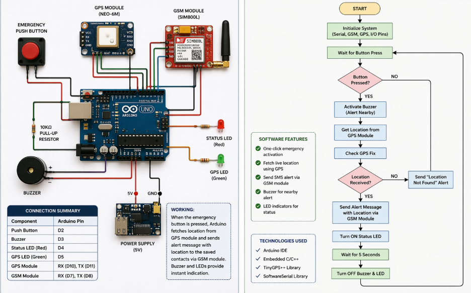
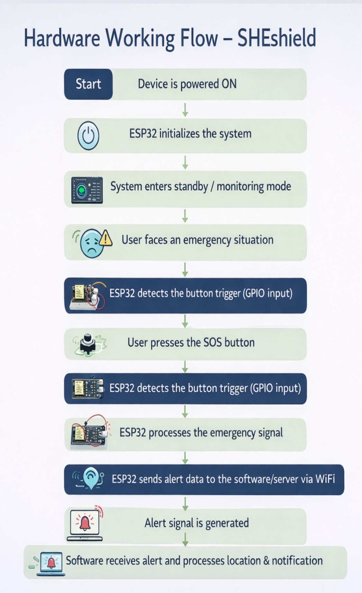
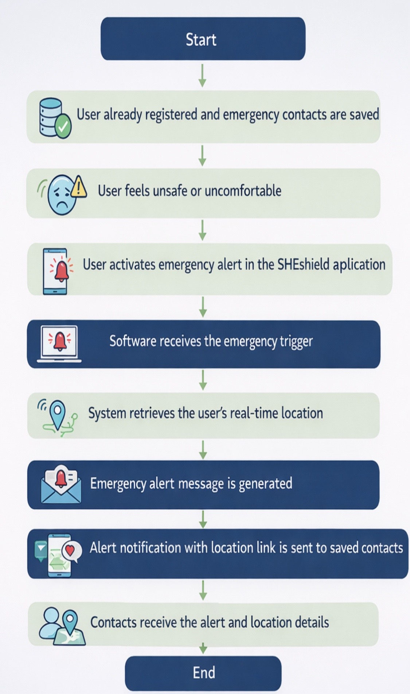

# 🛡️ Guardian – Smart Women Safety System

Guardian is an innovative women safety solution that provides **instant emergency alerts, real-time location tracking, and quick response** using a single action. It combines both hardware and software to ensure safety anytime, anywhere.

---

## 💡 Problem Statement
Women often face unsafe situations where immediate help is not available. Existing solutions are either slow, complicated, or fully dependent on smartphones.

---

## 🚀 Solution
Guardian provides a **one-click emergency system** that instantly sends alerts and location to trusted contacts, ensuring quick assistance in critical situations.

---

## ⚙️ Features
- 🔴 Emergency Button Trigger
- 📍 Live Location Tracking (GPS)  
- 📩 Instant Alerts via SMS/Call
- 📞 Fake call feature
- ⚖️ Legal Awareness  
- 🔊 Buzzer/Alarm for nearby attention  
- 🔌 Works with hardware (independent support)  
- 📱 Optional app/web integration  

---

## 🧠 How It Works
1. User presses the emergency button  
2. GPS module fetches location  
3. GSM/Wi-Fi sends alert message  
4. Emergency contacts receive location  
5. Alarm/buzzer is activated  

---

## 🛠️ Tech Stack
**Hardware:** Arduino / NodeMCU, GPS Module, GSM Module, Buzzer, Push Button  
**Software:** Arduino IDE, Embedded C, (Web/App if applicable)

---
## 🎯 Goal
To build a fast, reliable, and easy-to-use safety system that can help protect women in emergency situations.

---
## 🔌 Circuit Diagram

  

### Explanation
This diagram represents the hardware connections between ESP32, GPS module, GSM module, push button, and buzzer.  
The system detects an emergency trigger and sends alerts with location data.

---

## 🔧 Hardware Working Flow

  

### Explanation
The hardware system runs on ESP32 in standby mode.  
When the button is pressed, it processes the signal and sends alert data via WiFi/GSM.

---

## 💻 Software Working Flow

  

### Explanation
The software receives the emergency signal, fetches real-time location, generates alerts,  
and sends notifications to emergency contacts.

## 🔥 Future Improvements
- Mobile app integration  
- AI-based threat detection  
- Voice activation  
- Smaller wearable design  

---

## 👩‍💻 Author
Disha Pathak
